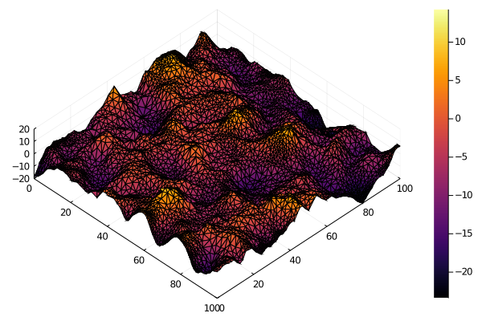
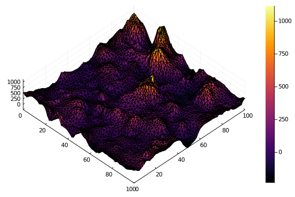

# SparseSpatialPrecisionMatrices.jl
Sparse precision matrices for random spatial fields using SPDE approximation

This draft package implements the stochastic partial differential equation (SPDE, Lindgren et al. 2011) method for constructing precision (i.e. inverse covariance) matrices for spatial Markov random fields.

In spatial statistics, we often want to model the autocorrelation of variables measured at many spatial locations, which has traditionally been done using  variograms, kriging and related methods based on Gaussian processes. Unfortunately, these methods usually require calculating a covariance matrix with one row/column for each spatial location, which scales *terribly*--`O(n^2)` for storage, and `O(n^3)` for computations.

If we instead make the assumption that the spatial field can be represented as a
grid or mesh with the Markov property (i.e., each point depends only on its immediate neighbors) we can then use a sparse precision matrix instead of a dense covariance matrix to do inference on the field.  The spatial structure of such fields closely approximates the common Matern covariance function.  For large fields, the computational savings of using a sparse Markov approximation can be *huge*.  A simple example follows.

First, we generate some random spatial locations from which to build our mesh. For the time being, this package uses `TriangleMesh` to do the meshing; this may change as Julia's mesh and FEM ecosystem evolves. Before putting them into the meshing routine from `TriangleMesh`, we do a k-means clustering on the spatial points to select some more evenly-spaced nodes.  We also `refine` the mesh once to get "nice" triangles that aren't too far from equilateral.  In general this is an important (and potentially finicky) step; a "bad" mesh can lead to numerical errors and precision matrices that are not positive definite.
```julia
using TriangleMesh
using Clustering
using Random
using Plots

Random.seed!(1)
n = 2_000
pts = 100 * rand(n-4, 2)
nodes = collect(kmeans(pts', 500).centers')
corners = [0 0; 100 0; 100 100; 0 100]
mesh = create_mesh([nodes; corners])
mesh = refine(mesh, divide_cell_into=4, voronoi=true)
```
Next, we specify the desired marginal variance and decorrelation length our Matern field, as well as its smoothness parameter `ν`.  From there it's easy to construct a precision matrix for our mesh:

```julia
using SparseSpatialPrecisionMatrices
using LinearAlgebra

r = 15 # decorrelation range
σ = 5 # marginal standard deviation
ν = 2  # smoothness parameter

Q = precision_matrix(mesh, r, σ, ν)
isposdef(Q) # true
length(nnz(Q.data)) / length(Q) # 4.97e-8
```
So the sparse precision matrix requires ~25 million times less storage than the corresponding covariance matrix.

We can then use the precision matrix to generate correlated Gaussian samples
by taking the Cholesky decomposition of the precision matrix, generating a vector of standard normal white noise `z`, and backsolving for the correlated field `x`.

```julia
using Distributions
using PDMats, SparseArrays
# sparse cholesky permutes the matrix, so we have to use the permuted lower
# triangle to get them in the right order
U = cholesky(Q).PtL'
x = U \ randn(mesh.n_point)
surface(mesh.point[1, :], mesh.point[2, :], x, zlim=4*[-σ, σ], camera=(45, 80))
```



We don't need to use normal white noise to drive the random field.  For instance, we can use Gamma noise if we want a non-negative field.

```julia
using Distributions
xg = U \ rand(Gamma(0.1, 100), mesh.n_point)
surface(mesh.point[1, :], mesh.point[2, :], xg, camera=(45, 80))
```




For statistical modeling, precision matrices can be used with the `MvNormalCanon` distribution from `Distributions.jl`.  Unfortunately, the autodiff packages don't currently have full sparse matrix functionality implemented, so there are some limits on what you can do for the moment.

```julia
using Distributions
using PDMats, SparseArrays
D = MvNormalCanon(PDSparseMat(sparse(Q)))
logpdf(D, x)
```

## References

Lindgren, F., Rue, H., & Lindström, J. (2011). An explicit link between Gaussian fields and Gaussian Markov random fields: the stochastic partial differential equation approach. Journal of the Royal Statistical Society, Series B, 73, 423–498. https://doi.org/10.1111/j.1467-9868.2011.00777.x
